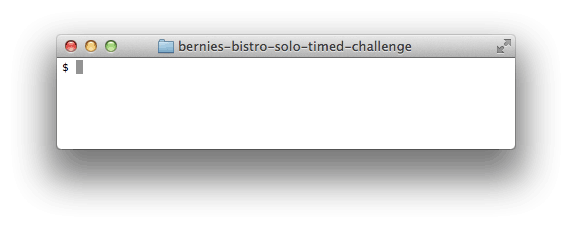

# Bernie's Bistro


## Summary
Congratulations! Your hard work modeling an orange grove for Fran the Farmer has paid off! She's referred you to her friend Bernie, the owner of Bernie's Bistro, a popular restaurant.

Bernie hired another programmer to build a computerized recipe system for the restaurant, but the programmer didn't finish the job before moving on to "an exciting opportunity in the virtual unicorn party space." Bernie needs someone to finish the restaurant's recipe system, and that person is you.

The other programmer was to have already completed the system, and Bernie would like a working program as soon as possible.  Complete the program to accomplish the use cases detailed below. Be wary of over-designing the program—your only job is to solve *these* problems, not to find other problems to solve.


### Recipe System Use Cases
  
*Figure 1*. Example usage, listing all recipes and displaying a specific recipe.

The recipe system should support two uses:  (1) users should be able to list all the recipes in the system and (2) users should be able to display the details for a specific recipe.  Figure 1 displays both of these uses and how Bernie would like to run the application.


## Releases
### Pre-Release:  Review the Code Base
As mentioned in the *Summary*, the previous developer left some code.  Review the provided code.  How was the developer approaching the problem?  Does this approach make sense?  Are there things you would do differently?  Are there things you would keep?


### Release 0: Implement the Minimum Viable Product
Building on the provided code base, implement the use cases described in the *Summary* and shown in Figure 1.  Remember, Bernie wants a working application soon, so we need to focus on just these features.

To recap how the program works, when users want to list all recipes, the program should display something like Figure 2.  When users want to see the details for a particular recipe, the program should display something like Figure 3 ... unless no recipe with the given id exists, then an error should be raised (see Figure 1).

```
$ ruby recipe_system.rb list
567 - Peanut Butter Coffee Brownie
938 - Bull Terrier Cake (for a puppy)
111 - Kale Burger
```
*Figure 2*.  Listing all the recipes.

```
$ ruby recipe_system.rb display 111
Recipe 111 - Kale Burger
The Kale Burger is one of our best selling dishes!
It combines the nutritional value of kale with
the taste of cow!

Ingredients:
Kale, Cow

Preparation Instructions:
Preheat the oven to 500 degrees. Put in a cow. Wait 10 minutes.
Put in some kale. Take out cow and kale. Put on bun. Serve HOT!
```
*Figure 3*.  Displaying a specific recipe.

*Note:*  Your top priority is to create a functioning recipe system.  There are a couple of tests in the spec files which should be completed. You're welcome to write more tests if you desire, but you are *not required* to do so. You have a limited amount of time; be mindful of how you spend it.  Tests alone cannot demonstrate your learning from the last two weeks.  Focus on implementation.


### Release 1:  Recipes in Alphabetical Order (Optional)
Congratulations on making it this far.  This release is optional.  If you would like to attempt this release, first commit your code locally so that if necessary, you can revert back to *Release 0*.

Currently, the recipe system lists recipes in whichever order they happen to be.  Bernie would like to see the recipes listed alphabetically by name.  (See Figure 4.)

  
*Figure 4*.  Listing recipes in alphabetical order by name.

